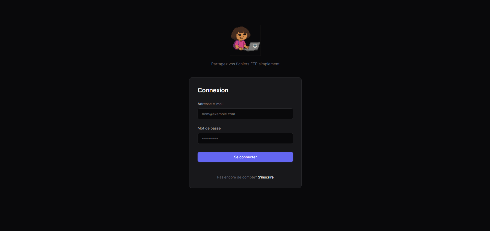
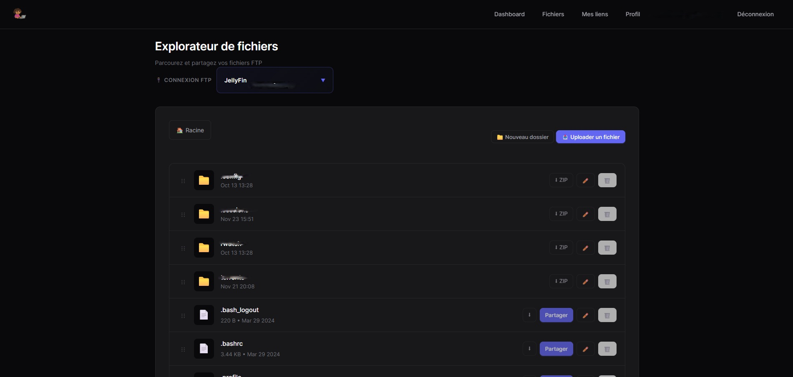
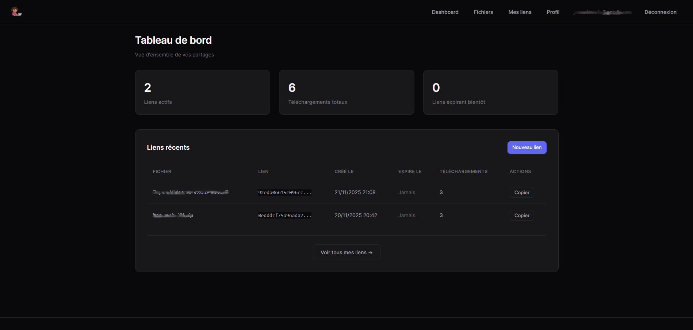

# 🚀 Dora Files - FTP to Web Bridge

<div align="center">


**Un système moderne de gestion de fichiers FTP via interface web**

[](https://php.net)
[](LICENSE)
[](CONTRIBUTING.md)

[Installation](#-installation-rapide) • [Fonctionnalités](#-fonctionnalités) • [Documentation](#-documentation) • [Support](#-support)

</div>

---

## 📖 À propos

Dora Files est une application web moderne qui permet de gérer vos fichiers FTP via une interface élégante et intuitive. Transformez votre serveur FTP en un système de partage de fichiers professionnel avec authentification, gestion multi-utilisateurs et liens de partage sécurisés.

## ✨ Fonctionnalités

### 🎯 Core Features
- ✅ **Interface moderne** - Design sombre avec thème Inter & Tailwind-inspired
- 📁 **Navigateur de fichiers** - Parcourez vos fichiers FTP comme un explorateur local
- ⬆️ **Upload/Download** - Téléchargement de fichiers avec barre de progression
- 🔗 **Liens de partage** - Créez des liens de téléchargement avec expiration
- 👤 **Multi-utilisateurs** - Gestion complète des comptes utilisateurs

### 🔒 Sécurité
- 🔐 **Authentification 2FA** - TOTP avec Google Authenticator
- 🛡️ **Protection CSRF** - Tous les formulaires protégés
- 🔑 **Chiffrement** - Credentials FTP chiffrés (AES-256-CBC)
- 🚦 **Rate Limiting** - Protection contre les abus
- 📝 **Journal d'activité** - Traçabilité complète des actions

### 🎨 Gestion avancée
- 🌐 **Multi-FTP** - Gérez plusieurs connexions FTP par utilisateur
- 📊 **Statistiques** - Dashboard avec métriques d'utilisation
- 🔄 **Code de backup** - Codes de récupération pour 2FA
- 🎯 **Permissions** - Contrôle d'accès granulaire
- 📧 **Logs sécurité** - Monitoring des tentatives de connexion

---

## 🚀 Installation rapide

### Prérequis

- **PHP** >= 8.1
- **MySQL** >= 5.7 ou **MariaDB** >= 10.2
- **Extensions PHP** : `pdo`, `pdo_mysql`, `openssl`, `ftp`
- **Composer** - Gestionnaire de dépendances PHP
- **Serveur Web** - Apache ou Nginx

### Installation en 3 étapes

#### 1️⃣ Cloner le repository

```bash
git clone https://github.com/a8naaijetvi2lunk/dora-files.git
cd dora-files
```

#### 2️⃣ Installer les dépendances

```bash
composer install --no-dev --optimize-autoloader
```

#### 3️⃣ Lancer l'installation

Accédez à `https://votre-domaine.com` dans votre navigateur.

L'assistant d'installation vous guidera à travers :
1. ✅ Vérification des prérequis
2. 🗄️ Configuration de la base de données
3. 👤 Création du compte administrateur
4. 🔧 Configuration FTP
5. ✨ Installation terminée !

---

## 🔧 Configuration manuelle (optionnel)

Si vous préférez configurer manuellement :

### 1. Configuration de l'environnement

```bash
cp .env.example .env
nano .env
```

Générez une clé de chiffrement :

```bash
php -r "echo 'APP_ENCRYPTION_KEY=base64:' . base64_encode(random_bytes(32)) . PHP_EOL;"
```

### 2. Configuration de la base de données

Créez votre base de données MySQL :

```sql
CREATE DATABASE dorafiles CHARACTER SET utf8mb4 COLLATE utf8mb4_unicode_ci;
CREATE USER 'dorafiles'@'localhost' IDENTIFIED BY 'votre_mot_de_passe';
GRANT ALL PRIVILEGES ON dorafiles.* TO 'dorafiles'@'localhost';
FLUSH PRIVILEGES;
```

### 3. Exécuter les migrations

```bash
php database/migrations/001_initial_schema.php
php database/migrations/002_profile_feature.php
php database/migrations/003_two_factor_auth.php
```

### 4. Créer un utilisateur

```bash
php bin/create-test-user.php
```

---

## 📁 Structure du projet

```
dora-files/
├── app/                    # Logic applicative
│   ├── Services/          # Services métier
│   ├── Security/          # Middleware de sécurité
│   └── helpers.php        # Fonctions utilitaires
├── bin/                   # Scripts utilitaires
├── config/                # Configurations (cron, logrotate)
├── database/              # Migrations SQL
│   └── migrations/
├── public/                # Assets publics (CSS, images)
├── setup/                 # Assistant d'installation
├── storage/               # Logs et données
│   └── logs/
├── vendor/                # Dépendances Composer
├── views/                 # Templates PHP
│   ├── auth/             # Pages d'authentification
│   ├── dashboard/        # Pages dashboard
│   └── profile/          # Pages profil utilisateur
├── .env.example          # Configuration exemple
├── composer.json         # Dépendances PHP
└── index.php            # Point d'entrée
```

---

## 🎨 Screenshots

<div align="center">

### Interface de connexion


### Navigateur de fichiers


### Dashboard utilisateur


</div>

---

## 🔐 Sécurité

Dora Files intègre plusieurs couches de sécurité :

- ✅ Protection CSRF sur tous les formulaires
- ✅ Requêtes SQL préparées (PDO)
- ✅ Échappement HTML automatique
- ✅ Rate limiting sur les téléchargements et authentification
- ✅ Chiffrement AES-256-CBC pour les credentials FTP
- ✅ Headers de sécurité (CSP, X-Frame-Options, etc.)
- ✅ Validation stricte des entrées utilisateur
- ✅ Protection contre path traversal
- ✅ Authentification à deux facteurs (TOTP)
- ✅ Codes de backup chiffrés (bcrypt)

### Rapporter une vulnérabilité

Si vous découvrez une faille de sécurité, merci de nous la signaler à :
📧 **noreply@yvescharvis.fr**

---

## 🔄 Maintenance

### Tâches automatisées

Configurez des tâches cron pour la maintenance :

```bash
# Nettoyage quotidien (2h du matin)
0 2 * * * /usr/bin/php /path/to/dora-files/bin/cleanup.php

# Rotation des logs (2h15 du matin)
15 2 * * * /usr/bin/php /path/to/dora-files/bin/cleanup-logs.php
```

### Rotation des logs

```bash
sudo cp config/logrotate.conf /etc/logrotate.d/dorafiles
sudo chmod 644 /etc/logrotate.d/dorafiles
```

---

## 🛠️ Configuration avancée

### Apache

```apache
<VirtualHost *:443>
    ServerName files.votredomaine.com
    DocumentRoot /var/www/dora-files

    <Directory /var/www/dora-files>
        Options -Indexes +FollowSymLinks
        AllowOverride All
        Require all granted
    </Directory>

    # SSL Configuration
    SSLEngine on
    SSLCertificateFile /path/to/cert.pem
    SSLCertificateKeyFile /path/to/key.pem
</VirtualHost>
```

### Nginx

```nginx
server {
    listen 443 ssl http2;
    server_name files.votredomaine.com;
    root /var/www/dora-files;

    ssl_certificate /path/to/cert.pem;
    ssl_certificate_key /path/to/key.pem;

    index index.php;

    location / {
        try_files $uri $uri/ /index.php?$query_string;
    }

    location ~ \.php$ {
        fastcgi_pass unix:/var/run/php/php8.1-fpm.sock;
        fastcgi_index index.php;
        include fastcgi_params;
        fastcgi_param SCRIPT_FILENAME $document_root$fastcgi_script_name;
    }

    location ~ /\. {
        deny all;
    }
}
```

---

## 🤝 Contribution

Les contributions sont les bienvenues ! Consultez [CONTRIBUTING.md](CONTRIBUTING.md) pour plus d'informations.

### Comment contribuer

1. Fork le projet
2. Créez une branche feature (`git checkout -b feature/AmazingFeature`)
3. Commit vos changements (`git commit -m 'Add some AmazingFeature'`)
4. Push sur la branche (`git push origin feature/AmazingFeature`)
5. Ouvrez une Pull Request

---

## 🐛 Support

- 💬 [Discord Community](https://discord.gg/CXfC55vj)
- 🐛 [Issue Tracker](https://github.com/a8naaijetvi2lunk/dora-files/issues)
- 📧 Email: a8naaijetvi2lunk@gmail.com

---

## 📝 Changelog

Consultez [CHANGELOG.md](CHANGELOG.md) pour voir l'historique des versions.

### Version actuelle : 2.0.0

**Nouveautés :**
- ✨ Système d'installation automatique (WordPress-style)
- 🔐 Authentification à deux facteurs (2FA/TOTP)
- 📊 Dashboard utilisateur avec statistiques
- 🌐 Support multi-connexions FTP
- 📝 Journal d'activité complet
- 🎨 Interface moderne et responsive

---

## 📜 License

Ce projet est sous licence MIT. Voir [LICENSE](LICENSE) pour plus d'informations.

---

## 👏 Remerciements

- [Inter Font](https://rsms.me/inter/) - Police moderne
- [Endroid QR Code](https://github.com/endroid/qr-code) - Génération QR codes
- [OTPHP](https://github.com/Spomky-Labs/otphp) - Implémentation TOTP
- Tous les contributeurs qui ont participé à ce projet

---

<div align="center">

**Fait avec ❤️**

[⬆ Retour en haut](#-dora-files---ftp-to-web-bridge)

</div>
